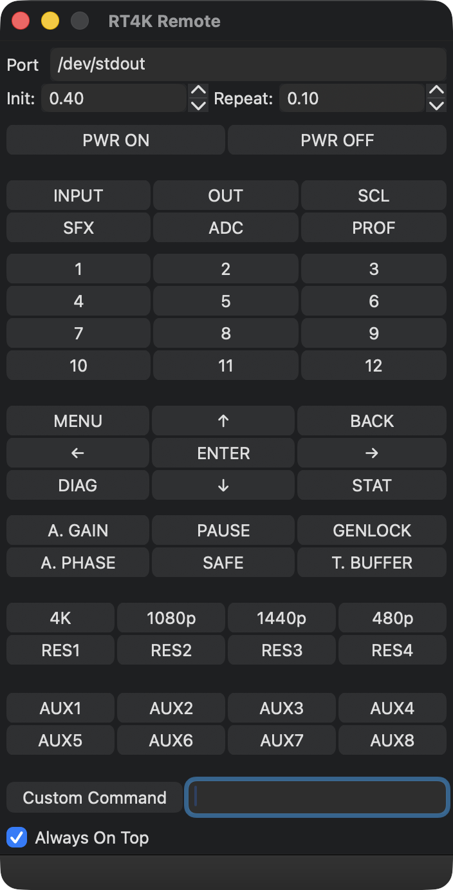

# RetroTINK-4K Remote



A desktop recreation of the [RetroTINK-4K](https://www.retrotink.com/product-page/retrotink-4k) remote control that issues commands over USB serial, written in wxPython.

## Requirements

- [RetroTINK-4K firmware 1.6.6 or newer](https://retrotink-llc.github.io/firmware/), which adds [USB serial command support](https://consolemods.org/wiki/AV:RetroTINK-4K#USB_Serial_Configuration)
- Python 3.10+
- [wxPython](https://wxpython.org) and [PySerial](https://pyserial.readthedocs.io/en/latest/pyserial.html)

```shell
pip install wxPython pyserial
```

## Usage

Connect the RetroTINK-4K to your PC via USB, then enter its serial port in the **Port** field and click any button. The port value is persisted to `config.json` alongside the script.

Buttons cover power, input selection, profile recall, navigation, resolution presets, and AUX slots. A **Custom Command...** button lets you send arbitrary serial commands. **Always On Top** keeps the window above other applications.

### Hold-to-repeat

Buttons behave like keyboard autorepeat: a single click sends one command. Holding a button sends once immediately, pauses for `_HOLD_INITIAL_DELAY` (default 0.4 s), then repeats at `_HOLD_REPEAT_INTERVAL` (default 0.1 s) until released. Both constants are defined at the top of `remote.pyw` and can be adjusted to taste.

Serial I/O runs on a background thread so the UI stays responsive during holds.